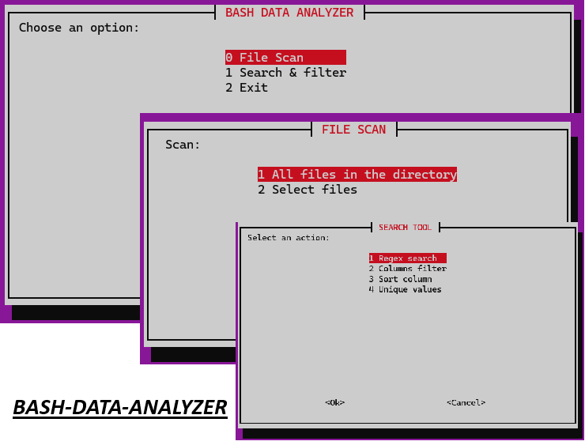

# Bash Data Analyzer

This Bash-based tool provides a robust command-line interface for analyzing CSV/TSV datasets. Inspired by the original `bash-data-analysis-tool` project, this fork modernizes the UI and enhances functionality for practical applications in data auditing, inspection, and filtering tasks often required in data operations or technical support environments.

## Key Features

* **Interactive Menu** using `whiptail`
* **Function Scan Mode**

  * Detects file structure
  * Inspects headers and delimiters
  * Counts rows and columns
  * Displays content previews (head/tail) with adjustable line limits
  * Reports similarity between files based on content hash comparison
    
* **Search & Filter Mode**

  * Search with regular expressions (globally or by column)
  * Extract rows/columns under custom conditions (multi-column filtering)
  * Sort data based on a specific column
  * List unique values of any column
 
    

## Requirements

* Bash (Bourne Again SHell)
* `awk`
* `whiptail`
* `sort`, `uniq`, `head`, `tail`, `wc`
* Compatible with most Unix-based environments (tested on Linux)


## Usage

1. **Clone this repository:**

```bash
git clone https://github.com/aalopez76/bash-data-analyzer.git
```

2. **Navigate to the directory:**

```bash
cd bash-data-analyzer
```

3. **Provide your CSV/TSV file:**
   Place your file in `data_sets/` or configure the tool to accept custom paths.

4. **Run the main tool:**

```bash
./app.sh
```

5. **Interact with the menu:**
   Follow the on-screen interface to:

* Scan and inspect files (via `file-scan.sh`)
* Filter, sort, search, and explore column values (via `search.sh`)

6. **Review results:**
   Output files are saved in the `output/` folder and logs are kept in `history/`.

---

## License

MIT License
