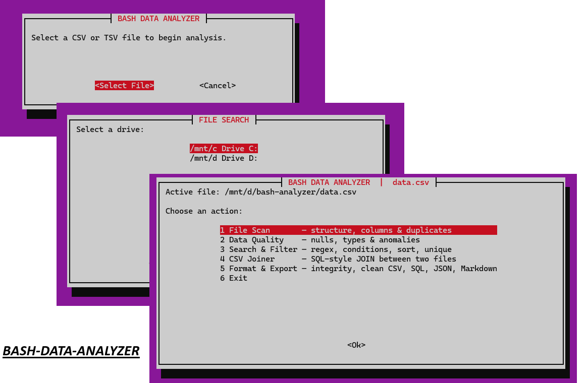

# Bash Data Analyzer

A Bash-based command-line suite for analyzing CSV/TSV datasets. Inspired by the original `bash-data-analysis-tool` project, this fork modernizes the UI with an interactive file explorer and ships five independent analysis modules covering inspection, quality auditing, search, joining, and multi-format export — practical for data operations, technical support, and ad-hoc data work in a terminal.

## Key Features

* **Interactive UI** powered by `whiptail` (no flags or piping needed)
* **Built-in file explorer** — pick any CSV/TSV file from any drive without typing a path
* **CRLF-safe** — normalizes Windows line endings into a temp copy so AWK and field comparisons work correctly under WSL
* **Auto delimiter detection** — comma, semicolon, or tab; inspected from the data row, not the header
* **Five analysis modules** accessible from a single menu:

  * **File Scan** — file structure, headers, delimiter, row/column counts, head/tail preview with adjustable line limits, and a duplicate-row report based on content hashing
  * **Data Quality** — per-column null map, type anomaly count, whitespace issues, and duplicate-row detection across the full dataset
  * **Search & Filter** — regex search (globally or by column), multi-condition column filtering with comparison operators, numeric-aware sorting on any column, and unique-value listing
  * **CSV Joiner** — SQL-style JOIN between two files supporting `INNER`, `LEFT`, `RIGHT`, and `FULL OUTER`; the result becomes the active dataset, ready for any other module
  * **Format & Export** — structural integrity check, type inference, and exports to **Clean CSV** (malformed rows removed, nulls filled), **SQL INSERTs** (with configurable table name), **JSON** array, or **Markdown** table

* **Result-preview workflow** — every operation shows a preview first, then asks whether to save to `output/`
* **Automatic archiving** — on exit, all `.txt` reports in `output/` are moved into `history/` so the next session starts clean
* **Integration test suite** under `tests/` with a `whiptail` mock for fully scripted, repeatable runs



## Requirements

* Bash (Bourne Again SHell)
* `whiptail` (`apt install whiptail` on Debian/Ubuntu)
* Standard Unix utilities: `awk`, `grep`, `sort`, `uniq`, `head`, `tail`, `wc`, `find`, `tr`, `mktemp`, `sha256sum`
* Compatible with Linux, macOS, and Windows via WSL

## Usage

1. **Clone this repository:**

```bash
git clone https://github.com/aalopez76/bash-analyzer.git
```

2. **Navigate to the directory:**

```bash
cd bash-analyzer
```

3. **Run the main tool:**

```bash
./app.sh
```

4. **Select a file:**
   The app opens a built-in file explorer rooted at the available drives. Navigate into any directory and pick the CSV or TSV file you want to analyze — no need to copy files into the project or pass a path.

5. **Choose an action from the menu:**
   The active file is shown in the title bar and persists across menu invocations. Pick `File Scan`, `Data Quality`, `Search & Filter`, `CSV Joiner`, or `Format & Export`. Use `Exit` (option 6) to leave the app.

6. **Review and save results:**

   * Each module shows a preview before saving.
   * Reports land in `output/` as `.txt`; exported datasets land as `.csv`, `.sql`, `.json`, or `.md`.
   * On exit, `.txt` reports are archived into `history/` automatically.

## Running the test suite

The `tests/` directory contains an integration test suite that mocks `whiptail` to drive the app non-interactively:

```bash
bash tests/integration_test.sh
```

It covers the File Scan, Regex Search, and Column Filter flows end to end, plus focused tests for duplicate detection and SQL export.

## Project layout

```
app.sh                    # entry point — file picker + main menu
move.sh                   # post-exit archiver (output/*.txt → history/)
functions/
  common.sh               # shared library: delimiter, CRLF norm, file explorer
  file-scan.sh            # Module 1
  data-quality.sh         # Module 2
  search.sh               # Module 3
  csv-joiner.sh           # Module 4
  format.sh               # Module 5
  file-search.sh          # helper
output/                   # generated reports and exports (gitignored)
history/                  # archived .txt reports (gitignored)
tests/                    # integration tests + whiptail mock
```

---

## License

MIT License
